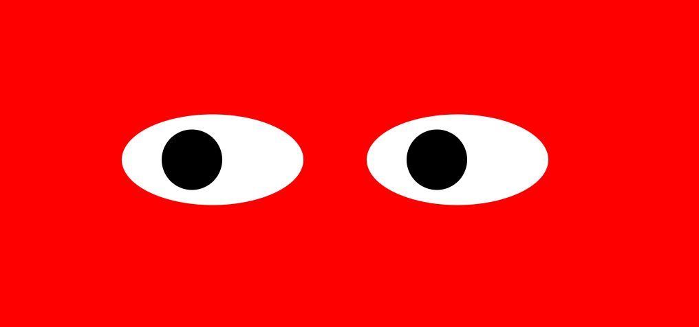

# Eyes-Exercise

<a href="https://marinela26.github.io/Eyes-Exercise/">Demo here</a>

## Table of Contents
* [Screenshots](#screenshots)
* [Description](#description)
* [Technologies Used](#technologies-used)
* [How to run](#how-to-run)
* [Future Improvement](#future-improvement)
* [License](#license)

## Screenshots

## Description

In this exercise, when the mouse movement event is used the position of the “eyes” elements is changing. Because of this JavaScript event a funny game is built.

## Technologies Used
- HTML5
- CSS3
- JavaScript

## How to Run

* Clone this repository

$ git clone https://github.com/Marinela26/Eyes-Exercise.git

* Go into the repository

$ cd Eyes-Exercise

## Future Improvement

- Make the "eyes" elements blink upon a mouseleave event.
- Make the "eyes" elements change color upon a mouse click event.

 ## License
 
This project is available under the [MIT License](). 

Please check full license document <a href="https://github.com/Marinela26/Eyes-Exercise/blob/main/LICENSE">here</a>
